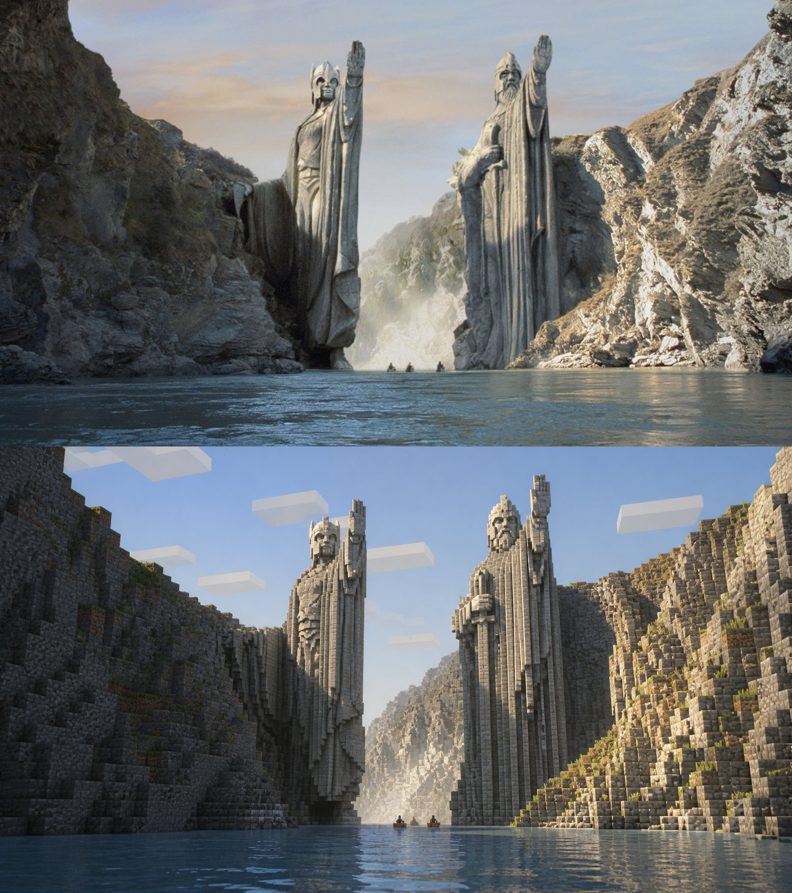

# minecraft-world

Transform a photo into a coherent Minecraft-like game world—not a pixel or voxel filter. 
把照片重建成完整统一的 Minecraft 风格游戏世界，而不是像素或体素滤镜。

It preserves recognizable subjects, composition, environment, dominant colors, time of day, and mood. 
它会保留原图中可辨识的主体、构图、环境、主色调、时间和氛围。

The whole frame is rebuilt with structural blocks, low-resolution surface textures, block clouds, game lighting, and atmospheric depth. 
整个画面会使用结构性方块、低分辨率表面纹理、方块云、游戏光照和空间雾化重新构建。

## Examples / 示例

<table>
  <tr>
    <td width="50%" align="center"></td>
    <td width="50%" align="center"></td>
  </tr>
</table>

  

## How to use / 使用方法

Install this repository as a Codex Skill, then attach a photo and invoke `$minecraft-world`. 
将这个仓库安装为 Codex Skill，然后上传照片并调用 `$minecraft-world`。

Example: `Use $minecraft-world to transform this photo.` 
示例：`使用 $minecraft-world 转换这张照片。`

The result should remain recognizable while every visible layer is reconstructed in the same Minecraft-like visual language. 
结果应保持原图可辨识，同时将所有可见层统一重建为 Minecraft 风格的视觉语言。
